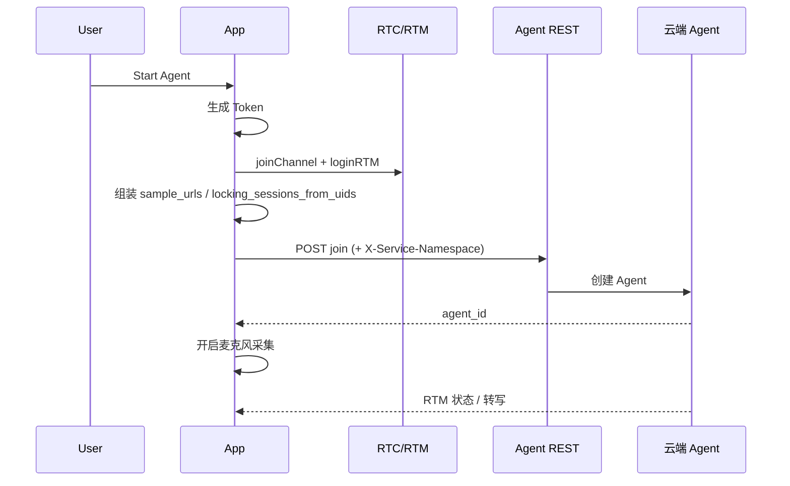

# 吉利多人对话 API — 端侧使用说明

本文说明本工程如何接入吉利「多人对话」REST API（基于 `20260528多人 对外API设计` / 桌面 `吉利多人API.pdf`）。端侧通过 `agroacore` 的 `AgentRepository` 直连 join / leave，并在 join 请求体中携带多人 SAL、拒识、声纹注册等配置。

## 新服务器 vs 旧部署（必读）

吉利已切换 **新 REST 网关**，与工程里旧的私有网关不是同一套：

| 能力 | 旧（勿再用于多人联调） | 新（PDF / 当前默认） |
|------|------------------------|----------------------|
| join / leave | `http://{GEELY_PRIVATE_IP}:9090/.../projects/{APP_ID}/join`（`USE_PRIVATE_ENV=true`） | `https://api-test.agora.io/hzacsdev01t-ctel/.../join` |
| Header | 无 Namespace | **`X-Service-Namespace: jili-test`** |
| LLM / TTS / 拒识 / 注册回调 | 仍多为 `http://47.96.173.253:8080/...`（业务服务，与 join 网关分离） | 同左，按吉利实际部署填写 |

端侧 `USE_GEELY_MULTI_API=true` 时，**join URL、Header、body 字段名已按 PDF 配置**；**`APP_ID` / `APP_CERTIFICATE` 与原来一致，不用换**。

若 join 返回 **HTTP 200 且 body 为 `{}`**（App 报解析不到 `agent_id`），更可能原因：

1. **新网关在云端**，join body 里配置的 LLM/TTS/拒识/注册回调仍是 `http://47.96.173.253:8080/...`，公网 Agent 访问不到或校验不通过（需吉利确认 8080 是否已暴露公网或换成新地址）
2. **join body 某字段** 与新后台约定不一致（如 `register`、`more_sal_config`、`stt_uploader` 等）— 需**后台查 join 日志**
3. 响应 JSON 结构变化（已兼容 `data.agent_id` 等；若仍为空则仍是服务端未创建 Agent）

请把 App 内 **join 预览的完整 JSON** 发给后台同事，对照 PDF 与服务器日志排查。

> **生产环境**：敏感凭证与 join 请求应由业务后端完成，客户端只使用短期 Token。下文以当前 **Demo 直连** 模式说明配置与调试方法。

---

## 1. 能力概览

| 能力 | 端侧实现 | 说明 |
|------|----------|------|
| 启动 Agent（join） | `AgentRepository.startAgentAsync` | 自动带 `X-Service-Namespace` 与多人 join body |
| 停止 Agent（leave） | `AgentRepository.stopAgentAsync` | 同上 Header |
| 动态增删说话人 | `addSalSpeakersAsync` / `deleteSalSpeakersAsync` | 已实现 REST，**UI 未接入**，可按需调用 |
| 声纹锁定（locking） | join `sal.sample_urls` + `more_sal_config` | 依赖本地注册 OSS URL 或 RTM 预注册 URL |
| 拒识 | join `parameters.main.interrupt_check` | 实际 HTTP 由吉利 `8080` 服务处理 |
| 声纹预注册回调 | join `parameters.main.register` | HTTP 回调到吉利服务；App 不直接收该 HTTP |

---

## 2. 环境与 URL 切换

REST 根路径由 `ConvoConfig.agentRestBaseUrl()` 决定，优先级如下：

```
USE_PRIVATE_ENV == true  →  PRIVATE_BASE_URL（内网 9090）
否则 USE_GEELY_MULTI_API == true  →  GEELY_MULTI_BASE_URL（api-test + hzacsdev01t-ctel）
否则  →  PUBLIC_BASE_URL（api.agora.io/cn）
```

配置文件：`agroacore/src/main/java/ai/conv/core/config/ConvoConfig.kt`

### 2.1 吉利多人测试环境（默认）

```kotlin
const val USE_PRIVATE_ENV: Boolean = false
const val USE_GEELY_MULTI_API: Boolean = true

const val GEELY_MULTI_BASE_URL =
    "https://api-test.agora.io/hzacsdev01t-ctel/api/conversational-ai-agent/v2/projects"
const val SERVICE_NAMESPACE: String = "jili-test"
```

实际请求示例：

- **join**：`POST {GEELY_MULTI_BASE_URL}/{APP_ID}/join`
- **leave**：`POST {GEELY_MULTI_BASE_URL}/{APP_ID}/agents/{agentId}/leave`
- **Header**：`Authorization: agora token=<token>`、`X-Service-Namespace: jili-test`

### 2.2 声网公网（原 Quickstart）

```kotlin
const val USE_GEELY_MULTI_API: Boolean = false
const val USE_PRIVATE_ENV: Boolean = false
```

走 `PUBLIC_BASE_URL`，join body 使用旧字段 `pre_register`、`interrupt_check.timeout_seconds`，不发送 `X-Service-Namespace`。

### 2.3 吉利私有部署（内网 Agent 网关）

```kotlin
const val USE_PRIVATE_ENV: Boolean = true
const val USE_GEELY_MULTI_API: Boolean = false  // 私有环境优先
```

走 `PRIVATE_BASE_URL`（`http://{GEELY_PRIVATE_IP}:9090/...`），并在 join body 中附带私有 RTC/RTM 接入点。

---

## 3. 必配项清单

在 `ConvoConfig.kt` 中至少确认以下字段：

| 字段 | 用途 |
|------|------|
| `APP_ID` / `APP_CERTIFICATE` | Token 生成与 REST `Authorization: agora token=...` |
| `SERVICE_NAMESPACE` | 吉利测试环境必填 Header |
| `GEELY_PRIVATE_IP` | 吉利 LLM / TTS / 拒识 / 注册回调服务地址 |
| `LLM_URL` / `LLM_API_KEY` / `LLM_VENDOR` | join body 中 LLM 段 |
| `INTERRUPT_CHECK_URL` | 拒识服务 URL |
| `PRE_REG_CALLBACK_URL` | 声纹预注册 HTTP 回调（吉利后端接收） |
| `ASR_*` / `TTS_*` | 语音识别与合成 |

多人场景专用（`USE_GEELY_MULTI_API = true` 时生效）：

| 字段 | 默认值 | 含义 |
|------|--------|------|
| `LLM_MAX_HISTORY_GEELY_MULTI` | `"1"` | LLM 不带历史，上下文由吉利维护 |
| `INTERRUPT_CHECK_TIMEOUT_MS` | `3500` | 拒识超时（毫秒） |
| `REGISTER_GATE_TIMEOUT_SECONDS` | `30.0` | 声纹注册闸门超时 |
| `SAL_MAX_SESSION_COUNT` | `20` | `more_sal_config.max_session_count` |

---

## 4. 启动流程（App 侧）



1. 用户点击 **Start Agent**（`AgentChatActivity`）。
2. `TokenGenerator` 生成 RTC/RTM/REST 共用 Token。
3. RTC 入频道、RTM 登录并订阅频道消息。
4. `BiometricSalRegistry.getRuntimeSalSampleUrlsForAgent()` 收集已注册声纹的 http(s) PCM URL。
5. `BiometricSalRegistry.getLockingSessionsFromUids(primaryRtcUid)` 生成 `speaker_id → rtc uid` 映射。
6. `ConversationAgentRestCoordinator.startRemoteAgent()` → `AgentRepository.startAgentAsync()`。
7. 成功后开始默认麦克风采集；RTM 推送 Agent 状态与转写。

核心调用链：

- `AgentChatViewModel.runStartAgentOnceLocked()`
- `ConversationAgentRestCoordinator`
- `AgentRepository.buildJsonPayload()`

---

## 5. join 请求体（吉利多人）

当 `USE_GEELY_MULTI_API = true` 时，相对公网 Quickstart 的主要差异：

### 5.1 SAL

- 无本地 http(s) 样本：`sal.sal_mode = "pre_register"`（会话中云端预注册）。
- 有样本：`sal.sal_mode = "locking"`，并带 `sample_urls`。
- 同时写入 `parameters.more_sal_config`：
  - `locking_sessions_from_uids`：speaker_id → rtc uid
  - `register_session_uids` / `negative_locking_session_uids`
  - `max_session_count`

`locking_sessions_from_uids` 由 `BiometricSalRegistry.getLockingSessionsFromUids()` 根据 faceId 绑定的 userId 生成；未绑定时回退为当前会话主 RTC UID。

### 5.2 拒识与注册

```json
"parameters": {
  "main": {
    "interrupt_check": {
      "enabled": true,
      "url": "<INTERRUPT_CHECK_URL>",
      "api_key": "<LLM_API_KEY>",
      "timeout_ms": 3500,
      "labels": { "userName": "<labelUserId>" }
    },
    "register": {
      "enable": true,
      "callback_url": "<PRE_REG_CALLBACK_URL>",
      "gate_timeout_seconds": 30.0,
      ...
    }
  },
  "turn_detector": { "disable_interrupt": true },
  "more_sal_config": { ... }
}
```

### 5.3 LLM

- `llm.max_history = 1`（`effectiveLlmMaxHistory()`）。
- 完整对话上下文由吉利 LLM 服务维护；custom LLM 侧需支持 `speaker_id`（服务端实现）。

### 5.4 多人 RTC

- `remote_rtc_uids: ["*"]`：避免仅订阅本地 uid 列表导致其他参会者 ASR 被丢弃。

---

## 6. 声纹注册与 sample_urls

### 6.1 注册页（推荐）

1. 打开生物识别注册页，完成人脸 + 语音采集。
2. 配置 `app` 侧 `OSS_STS_TOKEN_URL` 后，PCM/人脸图上传 OSS，得到 **http(s) URL**。
3. 点击「保存到本地」，`BiometricSalRegistry` 持久化 faceId → pcmUrl。
4. 回到对话页 **Start Agent**，join 会自动带上 `sample_urls` 与 `more_sal_config`。

若 PCM 仍为 `local://` 占位，join 不会把该用户写入 `sample_urls`（日志 TAG `AgentRepository` / `SAL` 会有告警）。

### 6.2 会话中预注册（RTM）

云端预注册成功后，RTM 类型 `VOICE_PRINT_REGISTER_STATUS` 若携带 `audioUrl`：

- `ConversationalAIAPIImpl` 下载 PCM 到本地；
- `AgentChatViewModel` 保存 URL 并 **自动 stop + restart Agent**，使 `sample_urls` 生效。

> PDF 新方案通过 HTTP 回调下发 `pcm_base64` 到吉利后端，**不经过 App HTTP**。若仅走 base64 回调，需吉利服务转存 URL 或扩展 App RTM 解析（当前仍按 `audioUrl` 处理）。

---

## 7. 调试：预览 join 配置

在 `AgentChatActivity` 中可查看即将发送的 join 预览（URL、Headers、Body JSON），用于与 PDF / 联调平台对比。

预览内容来自 `AgentRepository.buildStartAgentConfigPreview()`，包含：

- `url`
- `headers`（含 `X-Service-Namespace`）
- `body`（完整 properties）

---

## 8. 动态增删说话人（API 已封装）

会话中若需热更新 SAL，可调用（需自行在业务层挂接）：

```kotlin
// 追加
AgentRepository.addSalSpeakersAsync(
    agentId = agentId,
    authToken = authToken,
    speakers = listOf(
        SalSpeakerAddRequest(
            uid = "6001",
            registerUuid = "uuid-xxx",
            speakerId = "speaker_a",
            sampleUrl = "https://.../a.pcm",
        ),
    ),
)

// 删除
AgentRepository.deleteSalSpeakersAsync(
    agentId = agentId,
    authToken = authToken,
    speakers = listOf(
        SalSpeakerDeleteRequest(
            registerUuid = "uuid-xxx",
            speakerId = "speaker_a",
        ),
    ),
)
```

URL 形如：

`{agentRestBaseUrl()}/{APP_ID}/agents/{agentId}/add_sal_speakers`

`speaker_id` 全局唯一；重复 add 已存在的 id 会被云端忽略（见 PDF）。

---

## 9. 后端依赖（需吉利侧配合）

以下能力 **不在 Android 代码内实现**，需在 `GEELY_PRIVATE_IP:8080`（或你们部署的等价服务）按 PDF 提供：

| 服务 | 配置项 | PDF 要点 |
|------|--------|----------|
| 拒识 | `INTERRUPT_CHECK_URL` | Request 增加 `speaker_id`、`is_unknown_speaker`；Response 增加 `should_interrupt`、`should_response` |
| 声纹注册回调 | `PRE_REG_CALLBACK_URL` | 支持 `registered_details[].pcm_base64` 批量结果 |
| LLM | `LLM_URL` | 单次请求仅当前文本 + `speaker_id`，上下文吉利维护 |

端侧只负责在 join 里填写 URL 与 `api_key`；联调失败时优先抓包对比 join body 与 Header。

---

## 10. 常见问题

**Q: join 返回 401 / 403？**  
检查 `APP_CERTIFICATE` 是否在声网控制台启用，Token 是否与 channel/uid 一致，`Authorization` 是否为 `agora token=<token>`。

**Q: join 返回 4xx 且提示 namespace？**  
确认 `USE_GEELY_MULTI_API = true` 且请求带 `X-Service-Namespace: jili-test`（与控制台环境一致）。

**Q: 多人只有一人能识别？**  
检查 `sample_urls` 是否均为 http(s)；查看 `more_sal_config.locking_sessions_from_uids` 是否把各 speaker 映射到正确 rtc uid。

**Q: 预注册后声纹未生效？**  
看 RTM 是否收到 `VOICE_PRINT_REGISTER_STATUS` 且含 `audioUrl`；成功后会触发 Agent 重启。仅 base64 HTTP 回调时需后端落库或转 URL。

**Q: 如何切回官方 Quickstart 公网？**  
`USE_GEELY_MULTI_API = false`，`USE_PRIVATE_ENV = false`。

---

## 11. 相关源码索引

| 文件 | 说明 |
|------|------|
| `agroacore/.../config/ConvoConfig.kt` | 环境开关、URL、Namespace、超时 |
| `agroacore/.../repository/AgentRepository.kt` | join/leave/SAL REST 与 body 组装 |
| `app/.../session/ConversationAgentRestCoordinator.kt` | 启停 Agent 协调 |
| `app/.../biometric/BiometricSalRegistry.kt` | 本地声纹与 locking 映射 |
| `app/.../ui/AgentChatViewModel.kt` | 会话启动与预注册后重启 Agent |
| `agroacore/.../convoai/ConversationalAIAPIImpl.kt` | RTM 声纹预注册 `audioUrl` 处理 |

更通用的工程说明见根目录 [README.md](../README.md)、架构见 [ARCHITECTURE.md](../ARCHITECTURE.md)。
